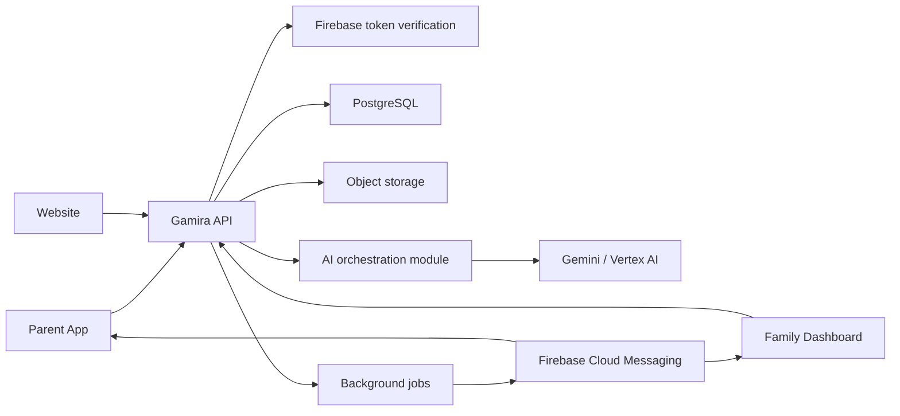

# System architecture

Every section below is marked **Implemented** or **Not implemented**. A
design document that does not say which is which is how a team ends up
believing a feature exists.

## Target system



## Backend shape - implemented

One deployable FastAPI application, plus one worker process running from the
same codebase and the same database:

```text
app/
  api/v1/        me, families, medications, care, sos, devices, ai
  ai/            provider, prompts, tools, policy, context, executor, live,
                 facts, summaries, usage, persona, validation
  jobs/          queue, registry, runner, scheduler, types, handlers/
  notifications/ push provider interface, fake and Firebase
  services/      authz, doses, scheduling, timeline, alerts, notifications,
                 devices, identity
  models/        identity, medication, care, devices, alerts, jobs, ai, audit
  schemas/       request and response models
  core/          config, errors, logging, middleware, security
  db/            base, session, types, seed
  worker.py      python -m app.worker
```

Route handlers hold no business rules: they resolve authorization, call a
service, and shape a response. The worker and the voice tool executor call the
*same* service functions, which is what stops the three paths drifting apart.

Not split into networked microservices, and not planned to be.

### Two processes

| Process | Entry point | Responsibility |
|---|---|---|
| API | `uvicorn app.main:app` | Requests. Returns quickly; writes nothing in a GET. |
| Worker | `python -m app.worker` | Everything that must happen with no screen open. |

The API keeps serving reads and writes if the worker stops, and the work the
worker was holding is picked up by the next worker once its leases expire. The
worker keeps running if the API stops.

## Trust boundaries

### Apps may hold

- Public API base URL
- Firebase public client configuration
- Short-lived Firebase ID token
- Short-lived Gemini Live token
- Locally cached, user-authorized data needed for offline UX

### Backend only

- Gemini or Vertex AI permanent credentials
- Database credentials
- Google service-account authority
- File-signing credentials
- Notification service authority
- Pricing and entitlement enforcement
- System prompts, tool policies and AI action execution

The API base URL is public and may be compiled into an Android app. Credentials
that grant service-level access must never be compiled into a client.

## Request flow

For ordinary requests:

1. The user signs in with Firebase Authentication.
2. The app sends `Authorization: Bearer <firebase-id-token>` to Gamira.
3. The backend verifies issuer, audience, expiry and signature.
4. The backend loads the internal user and family memberships.
5. The service checks permissions and performs the action.
6. The backend records important state transitions in the audit log.

The backend must never authorize a request using an app-provided role,
`family_id`, fixed development user header or hidden UI control.

## Realtime voice - implemented

Direct Live connection with a backend-minted ephemeral token.

```text
Parent App -> POST /api/v1/ai/live-sessions            (authenticated)
           <- session_id + one-use ephemeral token

Parent App -> Gemini Live WebSocket                    (with that token)

Gemini     -> functionCall
Parent App -> POST /api/v1/ai/live-sessions/{id}/tool-calls   data + mutations
Parent App -> allowlisted UI dispatcher                       navigation only
```

What the session endpoint does, in order: verify the bearer token; resolve the
family and the cared-for person from the caller's own membership rows; refuse a
suspended user or a revoked member; expire stale sessions; enforce the
concurrent-session and per-hour limits; mint a one-use token with the model,
modalities, system instruction and tool catalogue pinned into it; and record a
`live_sessions` row holding the tool snapshot and the token's *fingerprint*. The
token itself is returned once and never stored, so a database read cannot open a
voice session.

Every tool call is then re-authorized against that row at execution time - so a
membership revoked mid-conversation stops the next call, and a conversation
cannot talk its way into another family.

**The proxy option is not implemented**, and is not needed for safety: nothing
safety-critical depends on voice. Medication scheduling, reminders, dose
acknowledgement and SOS all work with the Live API unreachable, which
`tests/test_ai_outage.py` asserts.

### Local voice lab - development only

`gamira-parent-app-original/gemini_token_server.py` still exists and is now
labelled as what it is: an unauthenticated localhost tool that mints a token for
anyone who can reach the port. It survives only for the server console's
model/voice comparison panel. **No app uses it.**

## Background work - implemented

Durable, database-backed and idempotent. `background_jobs` is the queue and
`python -m app.worker` is the consumer. FastAPI's `BackgroundTasks` is used
nowhere: it runs inside the API process and vanishes with it, which is the wrong
shape for a medication reminder.

### The guarantees, and where each one comes from

| Guarantee | Mechanism |
|---|---|
| No job runs twice at once | `claim` takes a lease. PostgreSQL uses `SELECT ... FOR UPDATE SKIP LOCKED`; SQLite uses a compare-and-swap update per row. |
| A dead worker loses time, not work | `lock_expires_at`, then `recover_expired_leases`. The attempt is counted at claim time, so a job that reliably kills workers still reaches `max_attempts` and stops rather than cycling. |
| One tick, not five | Partial unique index on `dedupe_key` *while the job is queued or running*, so the same logical key is usable again next hour. |
| Retries do not storm | Exponential backoff, capped, with jitter. |
| A doomed job stops | `max_attempts`, then `failed` with a short `last_error_code` - never a traceback. |
| Shutdown does not abandon work | On a signal the worker stops claiming, drains in-flight jobs, and releases anything still unfinished past the grace period. |
| A failure is traceable | Every job carries the `request_id` of whatever caused it, so an API log line and its background consequence share an id. |

### Job types

Deterministic care - none of these may touch an AI provider:

`doses.materialize`, `doses.advance_status`, `medications.queue_reminders`,
`reminders.process_occurrences`, `appointments.queue_reminders`,
`notifications.deliver`, `notifications.retry_sweep`,
`alerts.escalation_check`.

AI - all of these may fail without affecting the list above:

`ai.weekly_summary`, `ai.live_sessions.expire`.

### Recurring work, and the Cloud path

The worker enqueues its own ticks, keyed on a time bucket
(`cron:<job_type>:<bucket>`), which is why two schedulers firing at once produce
one job. Set `WORKER_RUN_SCHEDULER=false` and have Cloud Scheduler enqueue the
same keys instead; the handlers cannot tell the difference. Replacing the queue
itself with Cloud Tasks means implementing the `JobQueue` protocol in
`app/jobs/queue.py` - no handler changes.

### Medication timing

`GET /seniors/{id}/doses` is now **read-only**. It used to generate the rows it
was about to return and derive their late/missed status on the way past, which
meant a dose was only missed once somebody looked at a screen. The worker does
both now, so time passing is what changes a dose.

## Files - not implemented

No file upload, download or storage exists. The plan, unchanged:

Store metadata in PostgreSQL and binary content in object storage. This includes:

- Profile images
- Prescription images
- Medical reports
- Generated PDF reports
- Optional, explicitly consented audio recordings

Use short-lived signed URLs or authenticated streaming. Never expose a permanent
public bucket for health-related files.

## Push notifications - implemented, provider not configured

The interface, the retry classification, the invalid-token revocation, the
per-device attempt records and the audit trail all exist and are tested.

- `FCM_PROVIDER=fake` records what would have been sent without calling anyone.
  It is refused in staging and production by configuration.
- `FCM_PROVIDER=firebase` sends through FCM HTTP v1 and needs real service
  account credentials, which have not been created.

So **no push has ever reached a real device**. The Parent App does not register
for push either: it has no service worker, so there is no token to register.
Every notification therefore still reaches somebody only when their app is
open - which is why every notification row carries an explicit `channel`, and
an `in_app` row is never described as delivered.

## Environments

Use separate configuration and data for:

- Local development
- Staging
- Production

Production data must never be copied into local development. Backend and database
should be colocated in a Google Cloud region supported by all required services
and appropriate for the product's data-residency obligations.

## Suggested production mapping

| Concern | Google Cloud service |
|---|---|
| API and WebSockets | Cloud Run |
| PostgreSQL | Cloud SQL for PostgreSQL |
| Files | Cloud Storage |
| Secrets | Secret Manager |
| User identity | Firebase Authentication |
| Push notifications | Firebase Cloud Messaging |
| Queued jobs | Cloud Tasks (replaces `DatabaseJobQueue` behind `JobQueue`) |
| Recurring jobs | Cloud Scheduler (`WORKER_RUN_SCHEDULER=false`) |
| Worker | Cloud Run service or job running `python -m app.worker` |
| AI | Gemini API or Vertex AI |
| Logs and errors | Cloud Logging and Error Reporting |

An API Gateway, load balancer, Cloud Armor, Redis and separate AI service are
later scaling decisions, not MVP prerequisites.

